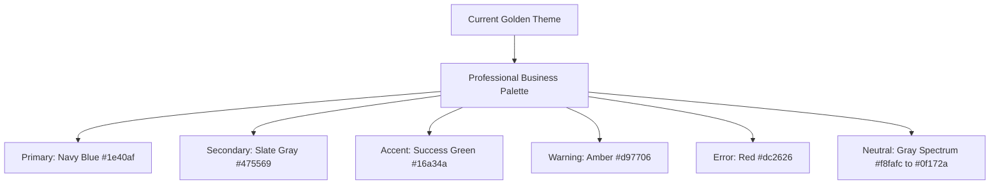
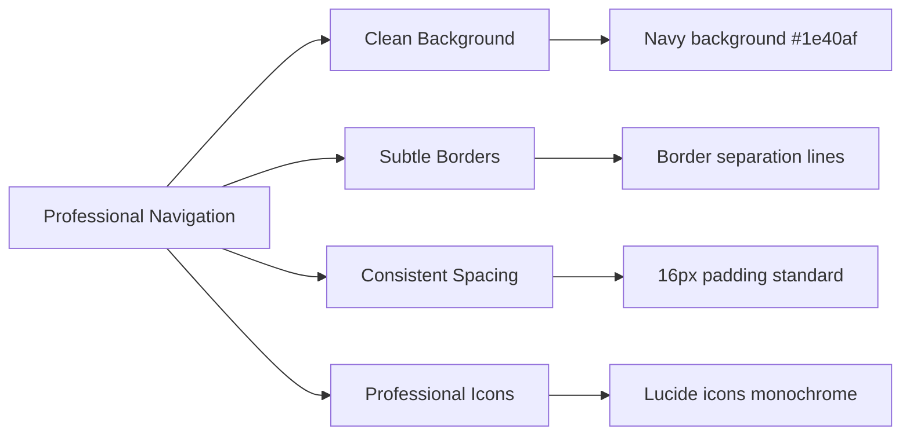
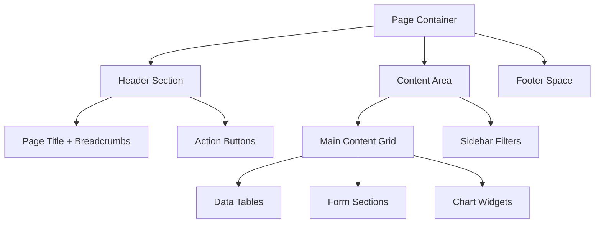
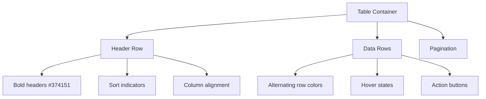
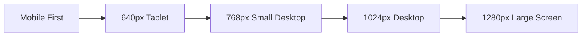

# Professional Interface Redesign - Shipping Management System

## Overview

This design document outlines the comprehensive redesign of the shipping management system's user interface to achieve an enterprise-grade professional appearance. The current interface, while functional, lacks the sophisticated visual design standards expected in modern business applications.

### Current State Analysis

The existing interface suffers from several professional presentation issues:
- Overuse of golden/yellow color scheme creating an unprofessional appearance
- Excessive animations and visual effects that distract from business functionality
- Inconsistent design patterns across different sections
- Lack of clear information hierarchy
- Gaming-like aesthetic rather than business-focused design

### Design Objectives

Transform the interface to reflect:
- Corporate professionalism and trustworthiness
- Clean, modern business application standards
- Improved usability and focus on core functionality
- Consistent branding appropriate for logistics industry
- Enhanced accessibility and readability

## Technology Stack Analysis

**Frontend Framework**: React with TypeScript
**Styling**: Tailwind CSS with custom golden theme
**UI Components**: Custom components with Lucide React icons
**State Management**: React Context API
**Authentication**: Role-based access control
**Build Tool**: Vite

## Professional Design System

### Color Palette Redesign



### Typography Hierarchy

| Element | Font Weight | Size | Color | Purpose |
|---------|-------------|------|-------|---------|
| Page Titles | Bold (700) | 2xl | Navy (#1e40af) | Primary headings |
| Section Headers | Semibold (600) | xl | Slate (#475569) | Secondary headings |
| Body Text | Regular (400) | base | Gray (#374151) | Content text |
| Captions | Medium (500) | sm | Gray (#6b7280) | Metadata |
| Interactive Text | Medium (500) | base | Blue (#2563eb) | Links/actions |

### Component Redesign Strategy

#### Navigation System

**Current Issues:**
- Overuse of golden gradients in navbar
- Excessive glow effects and animations
- Gaming-like visual treatment

**Professional Redesign:**



#### Dashboard Layout

**Current State:** Overly decorative with excessive gradients
**Target State:** Clean, data-focused professional layout

| Section | Current Design | Professional Redesign |
|---------|---------------|----------------------|
| Welcome Area | Golden gradient background | Clean white card with subtle shadow |
| Stat Cards | Gradient overlays | Minimal cards with colored accent bars |
| Quick Actions | Gaming-style hover effects | Subtle hover states with professional shadows |

### Layout Architecture

#### Page Structure Standardization



#### Grid System Implementation

- **12-column responsive grid** for consistent layouts
- **Standard spacing units**: 4px, 8px, 16px, 24px, 32px
- **Breakpoints**: Mobile (640px), Tablet (768px), Desktop (1024px), Large (1280px)

### Component Library Specifications

#### Professional Card Components

**Base Card Structure:**
```
- Background: Pure white (#ffffff)
- Border: 1px solid #e2e8f0
- Border Radius: 8px
- Shadow: Subtle (0 1px 3px rgba(0,0,0,0.1))
- Padding: 24px
```

**Card Variants:**
- **Data Card**: Statistics display with colored accent
- **Form Card**: Input containers with proper field spacing
- **Action Card**: Clickable cards with subtle hover states

#### Button System Redesign

| Button Type | Background | Border | Text Color | Use Case |
|------------|------------|--------|------------|----------|
| Primary | Navy (#1e40af) | None | White | Main actions |
| Secondary | White | Gray border | Navy | Secondary actions |
| Success | Green (#16a34a) | None | White | Confirmations |
| Danger | Red (#dc2626) | None | White | Delete actions |
| Ghost | Transparent | None | Navy | Subtle actions |

#### Form Components Enhancement

**Input Field Standards:**
- Height: 44px (accessible touch target)
- Border: 1px solid #d1d5db
- Focus state: 2px blue outline
- Error state: Red border with error message
- Padding: 12px horizontal, 10px vertical

**Select Dropdown Enhancement:**
- Custom styling to match input fields
- Proper keyboard navigation
- Clear visual hierarchy for options

### Data Visualization Improvements

#### Table Design Standards

**Professional Table Structure:**


**Table Styling Specifications:**
- Header background: #f8fafc
- Row separator: 1px solid #e2e8f0
- Hover state: #f1f5f9
- Text alignment: Right for Arabic content
- Action buttons: Minimal ghost style

#### Chart Integration

**Professional Chart Theme:**
- Color palette: Blues, grays, and accent colors
- Clean backgrounds without gradients
- Proper legends and axis labels
- Responsive sizing for all devices

### Mobile-First Responsive Design

#### Breakpoint Strategy



#### Mobile Navigation

**Professional Mobile Menu:**
- Collapsible sidebar instead of overlay
- Touch-friendly 44px minimum touch targets
- Clear visual separation between sections
- Easy thumb navigation patterns

### Accessibility & Professional Standards

#### Color Contrast Compliance

All text must meet WCAG 2.1 AA standards:
- Normal text: 4.5:1 contrast ratio minimum
- Large text: 3:1 contrast ratio minimum
- Interactive elements: Clear focus indicators

#### Screen Reader Optimization

- Proper heading hierarchy (h1, h2, h3)
- ARIA labels for complex interactions
- Alt text for all visual elements
- Skip navigation links

### Animation & Transition Guidelines

#### Professional Animation Principles

**Subtle Transitions Only:**
- Duration: 150-300ms maximum
- Easing: CSS ease-out for natural feel
- Purpose: User feedback, not decoration

**Acceptable Animations:**
- Button hover states (opacity change)
- Loading states (subtle spinners)
- Form validation feedback
- Page transitions (slide/fade)

**Eliminate:**
- Floating background elements
- Pulsing effects
- Rotation animations
- Golden glow effects

### Implementation Roadmap

#### Phase 1: Foundation Updates (Week 1-2)

**Step 1: Update Tailwind Configuration**

Replace the current `client/tailwind.config.js` with professional color palette:

```javascript
/** @type {import('tailwindcss').Config} */
export default {
  content: [
    "./index.html",
    "./src/**/*.{js,ts,jsx,tsx}",
  ],
  theme: {
    extend: {
      colors: {
        // Professional Business Color Palette
        primary: {
          50: '#eff6ff',
          100: '#dbeafe',
          200: '#bfdbfe',
          300: '#93c5fd',
          400: '#60a5fa',
          500: '#3b82f6',
          600: '#2563eb',
          700: '#1d4ed8',
          800: '#1e40af',
          900: '#1e3a8a',
        },
        secondary: {
          50: '#f8fafc',
          100: '#f1f5f9',
          200: '#e2e8f0',
          300: '#cbd5e1',
          400: '#94a3b8',
          500: '#64748b',
          600: '#475569',
          700: '#334155',
          800: '#1e293b',
          900: '#0f172a',
        },
        success: {
          50: '#f0fdf4',
          100: '#dcfce7',
          200: '#bbf7d0',
          300: '#86efac',
          400: '#4ade80',
          500: '#22c55e',
          600: '#16a34a',
          700: '#15803d',
          800: '#166534',
          900: '#14532d',
        },
        warning: {
          50: '#fffbeb',
          100: '#fef3c7',
          200: '#fde68a',
          300: '#fcd34d',
          400: '#fbbf24',
          500: '#f59e0b',
          600: '#d97706',
          700: '#b45309',
          800: '#92400e',
          900: '#78350f',
        },
        danger: {
          50: '#fef2f2',
          100: '#fee2e2',
          200: '#fecaca',
          300: '#fca5a5',
          400: '#f87171',
          500: '#ef4444',
          600: '#dc2626',
          700: '#b91c1c',
          800: '#991b1b',
          900: '#7f1d1d',
        },
      },
      fontFamily: {
        arabic: ['Tajawal', 'Arial', 'sans-serif'],
      },
      animation: {
        // Keep only essential, professional animations
        'fade-in': 'fadeIn 0.3s ease-out forwards',
        'slide-in': 'slideIn 0.3s ease-out forwards',
      },
      keyframes: {
        fadeIn: {
          '0%': { opacity: '0' },
          '100%': { opacity: '1' },
        },
        slideIn: {
          '0%': { opacity: '0', transform: 'translateY(10px)' },
          '100%': { opacity: '1', transform: 'translateY(0)' },
        },
      },
      boxShadow: {
        'professional': '0 1px 3px 0 rgba(0, 0, 0, 0.1), 0 1px 2px 0 rgba(0, 0, 0, 0.06)',
        'professional-md': '0 4px 6px -1px rgba(0, 0, 0, 0.1), 0 2px 4px -1px rgba(0, 0, 0, 0.06)',
        'professional-lg': '0 10px 15px -3px rgba(0, 0, 0, 0.1), 0 4px 6px -2px rgba(0, 0, 0, 0.05)',
      },
      spacing: {
        '18': '4.5rem',
        '88': '22rem',
      },
    },
  },
  plugins: [],
}
```

**Step 2: Update CSS Classes**

Replace `client/src/index.css` with professional styling:

```css
@tailwind base;
@tailwind components;
@tailwind utilities;

@layer base {
  * {
    direction: rtl;
  }

  body {
    font-family: 'Tajawal', Arial, sans-serif;
    direction: rtl;
    text-align: right;
    overflow-x: hidden;
    background-color: #f8fafc;
  }

  html {
    direction: rtl;
    scroll-behavior: smooth;
  }
}

/* Professional Animations Only */
@keyframes fadeIn {
  from {
    opacity: 0;
  }
  to {
    opacity: 1;
  }
}

@keyframes slideIn {
  from {
    opacity: 0;
    transform: translateY(10px);
  }
  to {
    opacity: 1;
    transform: translateY(0);
  }
}

@layer components {
  /* Professional Button System */
  .btn-primary {
    @apply bg-primary-600 hover:bg-primary-700 text-white font-medium py-3 px-6 rounded-lg shadow-professional hover:shadow-professional-md transition-all duration-200 ease-in-out;
  }

  .btn-secondary {
    @apply bg-white hover:bg-gray-50 text-secondary-700 font-medium py-3 px-6 rounded-lg shadow-professional hover:shadow-professional-md border border-secondary-200 hover:border-secondary-300 transition-all duration-200 ease-in-out;
  }

  .btn-success {
    @apply bg-success-600 hover:bg-success-700 text-white font-medium py-3 px-6 rounded-lg shadow-professional hover:shadow-professional-md transition-all duration-200 ease-in-out;
  }

  .btn-danger {
    @apply bg-danger-600 hover:bg-danger-700 text-white font-medium py-3 px-6 rounded-lg shadow-professional hover:shadow-professional-md transition-all duration-200 ease-in-out;
  }

  .btn-ghost {
    @apply bg-transparent hover:bg-secondary-50 text-primary-600 font-medium py-3 px-6 rounded-lg transition-all duration-200 ease-in-out;
  }

  /* Professional Input Fields */
  .input-field {
    @apply w-full px-4 py-3 border border-secondary-300 rounded-lg focus:outline-none focus:ring-2 focus:ring-primary-500 focus:border-transparent bg-white shadow-professional hover:shadow-professional-md transition-all duration-200 ease-in-out;
    height: 44px;
  }

  .input-field:focus {
    @apply shadow-professional-md;
    box-shadow: 0 0 0 3px rgba(59, 130, 246, 0.1), 0 4px 6px -1px rgba(0, 0, 0, 0.1);
  }

  .input-field.error {
    @apply border-danger-500 focus:ring-danger-500;
    box-shadow: 0 0 0 3px rgba(239, 68, 68, 0.1);
  }

  /* Professional Card System */
  .card {
    @apply bg-white rounded-lg shadow-professional hover:shadow-professional-md p-6 transition-all duration-200 ease-in-out;
    border: 1px solid #e2e8f0;
  }

  .card-elevated {
    @apply bg-white rounded-lg shadow-professional-md hover:shadow-professional-lg p-6 transition-all duration-200 ease-in-out;
    border: 1px solid #e2e8f0;
  }

  .card-interactive {
    @apply bg-white rounded-lg shadow-professional hover:shadow-professional-md p-6 transition-all duration-200 ease-in-out cursor-pointer;
    border: 1px solid #e2e8f0;
  }

  .card-interactive:hover {
    @apply border-primary-200;
  }

  /* Professional Navigation */
  .nav-item {
    @apply relative transition-all duration-200 ease-in-out;
  }

  .nav-item.active {
    @apply bg-primary-600 text-white;
  }

  .nav-item:hover:not(.active) {
    @apply bg-primary-50 text-primary-700;
  }

  /* Professional Table */
  .table-container {
    @apply bg-white rounded-lg shadow-professional overflow-hidden;
    border: 1px solid #e2e8f0;
  }

  .table-header {
    @apply bg-secondary-50 text-secondary-700 font-semibold;
  }

  .table-row {
    @apply border-b border-secondary-200 hover:bg-secondary-50 transition-colors duration-150;
  }

  .table-cell {
    @apply px-4 py-3 text-sm;
  }

  /* Professional Animations */
  .fade-in {
    animation: fadeIn 0.3s ease-out forwards;
  }

  .slide-in {
    animation: slideIn 0.3s ease-out forwards;
  }

  /* Professional Typography */
  .heading-1 {
    @apply text-2xl font-bold text-primary-800;
  }

  .heading-2 {
    @apply text-xl font-semibold text-secondary-700;
  }

  .heading-3 {
    @apply text-lg font-medium text-secondary-700;
  }

  .body-text {
    @apply text-base text-secondary-600;
  }

  .caption-text {
    @apply text-sm text-secondary-500;
  }

  .link-text {
    @apply text-base text-primary-600 hover:text-primary-700 transition-colors duration-150;
  }
}
```

#### Phase 2: Component Redesign (Week 3-4)

**Step 3: Professional Navigation Component**

Update `client/src/components/Layout/Navbar.tsx`:

```tsx
import React, { useState } from 'react';
import { NavLink } from 'react-router-dom';
import {
  Settings,
  DollarSign,
  ShoppingCart,
  Headphones,
  Truck,
  Home,
  Menu,
  X
} from 'lucide-react';
import { useAuth } from '../../contexts/AuthContext';
import { UserRole } from '../../types/auth';
import Logo from '../UI/Logo';

const Navbar: React.FC = () => {
  const { user } = useAuth();
  const [isMobileMenuOpen, setIsMobileMenuOpen] = useState(false);

  const filteredNavItems = navItems.filter(item =>
    item.roles.includes(user?.role as UserRole)
  );

  return (
    <nav className="bg-primary-800 text-white shadow-professional-lg">
      <div className="max-w-7xl mx-auto px-4 sm:px-6 lg:px-8">
        <div className="flex justify-between items-center h-16">
          {/* Logo */}
          <div className="flex items-center fade-in">
            <div className="flex-shrink-0 flex items-center">
              <div className="transform transition-transform duration-200 hover:scale-105">
                <Logo size="md" showText={false} />
              </div>
              <span className="text-xl font-semibold text-white mr-3">
                لوحة التحكم
              </span>
            </div>
          </div>

          {/* Desktop Navigation */}
          <div className="hidden md:block">
            <div className="flex items-baseline space-x-4 space-x-reverse">
              {filteredNavItems.map((item) => (
                <NavLink
                  key={item.path}
                  to={item.path}
                  className={({ isActive }) =>
                    `nav-item flex items-center space-x-2 space-x-reverse px-4 py-2 rounded-lg text-sm font-medium transition-all duration-200 ${
                      isActive
                        ? 'bg-primary-600 text-white'
                        : 'text-primary-100 hover:bg-primary-700 hover:text-white'
                    }`
                  }
                >
                  <span>{item.icon}</span>
                  <span>{item.label}</span>
                </NavLink>
              ))}
            </div>
          </div>

          {/* Mobile menu button */}
          <div className="md:hidden">
            <button
              onClick={() => setIsMobileMenuOpen(!isMobileMenuOpen)}
              className="inline-flex items-center justify-center p-2 rounded-md text-primary-100 hover:text-white hover:bg-primary-700 transition-colors duration-200"
            >
              {isMobileMenuOpen ? <X className="h-6 w-6" /> : <Menu className="h-6 w-6" />}
            </button>
          </div>
        </div>
      </div>

      {/* Mobile menu */}
      {isMobileMenuOpen && (
        <div className="md:hidden fade-in">
          <div className="px-4 pt-2 pb-3 space-y-2 bg-primary-900">
            {filteredNavItems.map((item) => (
              <NavLink
                key={item.path}
                to={item.path}
                onClick={() => setIsMobileMenuOpen(false)}
                className={({ isActive }) =>
                  `flex items-center space-x-3 space-x-reverse px-4 py-3 rounded-lg text-base font-medium transition-all duration-200 ${
                    isActive
                      ? 'bg-primary-600 text-white'
                      : 'text-primary-100 hover:bg-primary-700 hover:text-white'
                  }`
                }
              >
                <span>{item.icon}</span>
                <span>{item.label}</span>
              </NavLink>
            ))}
          </div>
        </div>
      )}
    </nav>
  );
};

export default Navbar;
```

#### Phase 3: Testing & Quality Assurance (Week 5-6)

**Step 4: Implementation Checklist**

- [ ] Replace golden color palette with professional colors
- [ ] Remove excessive animations and glow effects
- [ ] Update all component styling to use new design system
- [ ] Test responsive design on all screen sizes
- [ ] Verify accessibility compliance
- [ ] Conduct user testing with stakeholders
- [ ] Performance optimization
- [ ] Cross-browser compatibility testing
```

**Step 4: Professional Header Component**

Update `client/src/components/Layout/Header.tsx`:

```tsx
import React from 'react';
import { LogOut, User } from 'lucide-react';
import { useAuth } from '../../contexts/AuthContext';
import Logo from '../UI/Logo';

const Header: React.FC = () => {
  const { user, logout } = useAuth();

  const getRoleDisplayName = (role: string) => {
    const roleNames = {
      admin: 'مدير النظام',
      financial: 'القسم المالي',
      sales: 'المبيعات',
      customer_service: 'خدمات العملاء',
      operations: 'العمليات'
    };
    return roleNames[role as keyof typeof roleNames] || role;
  };

  return (
    <header className="bg-white shadow-professional border-b border-secondary-200">
      <div className="max-w-7xl mx-auto px-4 sm:px-6 lg:px-8">
        <div className="flex justify-between items-center h-16">
          {/* Company Logo */}
          <div className="flex items-center fade-in">
            <div className="flex-shrink-0">
              <Logo size="sm" showText={true} />
            </div>
          </div>

          {/* User Info and Actions */}
          <div className="flex items-center space-x-4 space-x-reverse">
            {/* User Info Card */}
            <div className="flex items-center space-x-3 space-x-reverse bg-secondary-50 rounded-lg px-4 py-2">
              <div className="w-8 h-8 bg-primary-600 rounded-full flex items-center justify-center">
                <User className="h-4 w-4 text-white" />
              </div>
              <div className="text-sm">
                <div className="font-medium text-secondary-900">{user?.name}</div>
                <div className="text-secondary-600">{getRoleDisplayName(user?.role || '')}</div>
              </div>
            </div>

            {/* Logout Button */}
            <button
              onClick={logout}
              className="btn-danger flex items-center space-x-2 space-x-reverse"
            >
              <LogOut className="h-4 w-4" />
              <span className="text-sm">تسجيل الخروج</span>
            </button>
          </div>
        </div>
      </div>
    </header>
  );
};

export default Header;
```

**Step 5: Professional Layout Component**

Update `client/src/components/Layout/Layout.tsx`:

```tsx
import React from 'react';
import { Outlet } from 'react-router-dom';
import Header from './Header';
import Navbar from './Navbar';

const Layout: React.FC = () => {
  return (
    <div className="min-h-screen bg-secondary-50">
      <Navbar />
      <Header />
      <main className="max-w-7xl mx-auto px-4 sm:px-6 lg:px-8 py-8">
        <div className="transition-all duration-300 ease-in-out">
          <Outlet />
        </div>
      </main>
    </div>
  );
};

export default Layout;
```

#### Professional Dashboard Card

```
┌─────────────────────────────────────┐
│  Total Shipments              📦   │
│  ──────────────────────────────     │
│  1,234                              │
│  +12% from last month              │
│  ■■■■■■■□□□ 75%                     │
└─────────────────────────────────────┘
```

#### Professional Navigation

```
┌─────────────────────────────────────┐
│ 🏢 Company Logo    User Name ⚙️ 🚪  │
├─────────────────────────────────────┤
│ 🏠 Dashboard                        │
│ 📊 Financial                        │
│ 📦 Operations                       │
│ 🔧 Settings                         │
└─────────────────────────────────────┘
```

#### Professional Form Layout

```
┌─────────────────────────────────────┐
│ Customer Information                │
│ ─────────────────                   │
│                                     │
│ Customer Name*                      │
│ [________________]                  │
│                                     │
│ Phone Number*                       │
│ [________________]                  │
│                                     │
│ [ Cancel ]      [ Save Customer ]   │
└─────────────────────────────────────┘
```

### Quality Assurance Standards

#### Visual Consistency Checklist

- [ ] Consistent spacing throughout application
- [ ] Professional color usage (no golden gradients)
- [ ] Proper typography hierarchy
- [ ] Minimal, purposeful animations
- [ ] Clean, business-appropriate aesthetics

#### Functional Requirements

- [ ] All interactive elements clearly identifiable
- [ ] Consistent behavior across similar components
- [ ] Proper loading and error states
- [ ] Responsive design on all screen sizes
- [ ] Accessibility compliance (WCAG 2.1 AA)

#### Testing Strategy

**Visual Regression Testing:**
- Screenshot comparison between old and new designs
- Cross-browser compatibility testing
- Mobile device testing on real devices

**User Experience Testing:**
- Task completion time measurement
- Error rate reduction verification
- User satisfaction surveys with business users

### Maintenance Guidelines

#### Design System Documentation

- Component usage guidelines
- Color palette specifications
- Typography usage rules
- Spacing and layout standards

#### Future Enhancement Strategy

- Quarterly design reviews
- User feedback integration process
- Progressive enhancement roadmap
- Accessibility audit schedule

---

This professional interface redesign will transform the shipping management system from its current gaming-like aesthetic to a sophisticated, enterprise-grade business application that inspires confidence and trust in users while maintaining excellent usability and functionality.